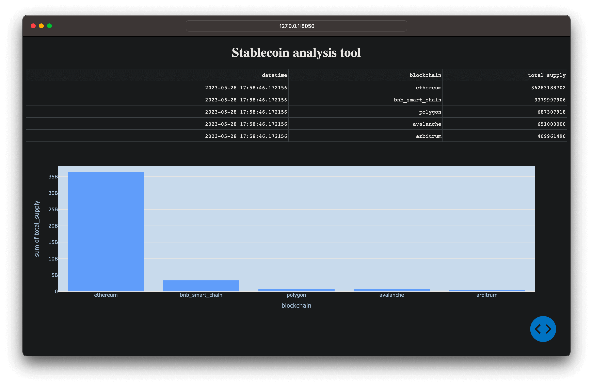
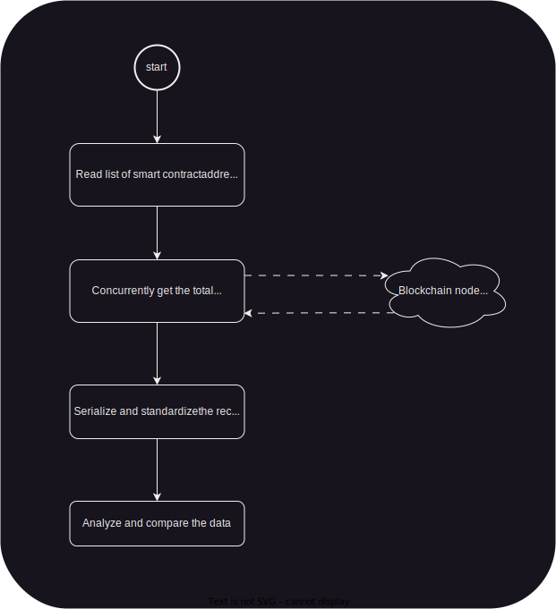

<div align="center">
  <h1>Stablecoin analysis tool</h1>
  <p><b>This tool is made as part of the <a href="https://www.skillshare.com/en/classes/Next-Level-Python-Become-a-Python-Expert/1997963259?via=search-layout-grid">"Next-Level Python: Become a Python Expert"</a> Skillshare course assignment.</b></p>
</div>


## Table of contents

- [Overview](#overview)
  - [Description](#description)
  - [Workflow diagram](#workflow-diagram)
- [Run it](#run-it)
- [Lesson notes](#lesson-note)


## Overview

**Stablecoin market capitalization comparison by blockchain.**




### Description

This Python program fetches the supply of the [USDT](https://coinmarketcap.com/currencies/tether/)
stablecoin on different blockchains (Ethereum, Polygon, etc.) concurrently, and
generates a table and graph for comparison.

It utilizes the following concepts taught in the course:

- concurrency *(refer to main.py)*
- type hints/annotation *(used throughout the codebase)*
- iterators and generators *(refer to main.py; commented in the main function)*
- context managers *(refer to main.py; write_data_to_file function)*
- lambda (anonymous) functions *(refer to main.py; commented in the main function)*


### Workflow diagram




## Run it

First, install the dependencies with:

```sh
pip install -r requirements.txt
```

Then, run the main script with:

```sh
python comparator/main.py
```

Finally, open `http://127.0.0.1:8050/` in your favorite browser.


## Lesson notes

Dataclasses:

- @dataclass
- default_factory, init=False
- setter


Functools:

- @cached_property
- @singledispatch


Concurrent programming:

- asyncio.gather()


Iterators:

- generators (lazy)
- yield
